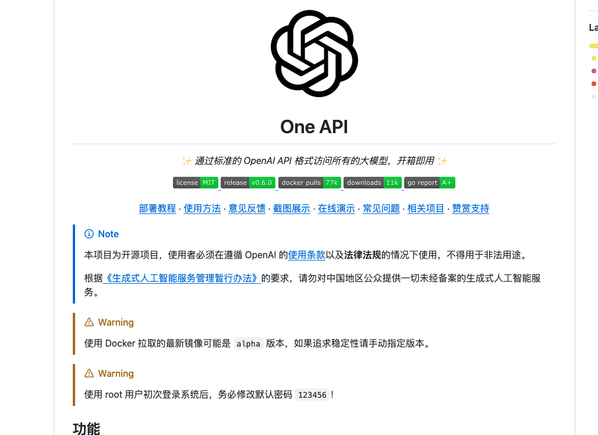

# chat-gpt-full-stack
chatgpt 全栈解决方案  快速接入openai 
产品方案  运营策略  技术方案+实现

chatgpt full stack solution  

中文 - [English](./README_en.md)

# 持续更新中...
# 聊天UI方案

# SPA 
> SPA的全称是Single-Page Application，也就是单页应用程序。它是一种Web应用程序的开发模式，不同于传统的多页面Web应用程序，在SPA中整个应用程序只有一个HTML页面，其余页面内容通过JavaScript动态替换加载，实现无刷新加载页面，提高了应用程序的性能和用户体验。
## vue2
### [ChatGPT_JCM](https://github.com/202252197/ChatGPT_JCM)
> OpenAI管理界面，聚合了OpenAI的所有接口进行界面操作(所有模型、图片、音频、微调、文件)等，支持Markdown格式(公式、图表，表格)等

## vue3
### [ChatGPT Web](https://github.com/Chanzhaoyu/chatgpt-web)
> 用 Express 和 Vue3 搭建的 ChatGPT 演示网页

#### 功能
- [✓] 双模型
- [✓] 多会话储存和上下文逻辑
- [✓] 对代码等消息类型的格式化美化处理
- [✓] 访问权限控制
- [✓] 数据导入、导出
- [✓] 保存消息到本地图片
- [✓] 界面多语言
- [✓] 界面主题

 
# SSR方案
>SSR是服务器端渲染（Server-Side Rendering）的简称。它是一种技术，可以将服务器端生成的 HTML 直接返回给客户端，而不是在客户端执行 JavaScript 代码生成 HTML。与客户端渲染相比，SSR 可以提高页面的首次加载速度、SEO 的效果以及降低首屏渲染成本等优势。SSR 的主要实现方式是使用 Node.js 或其他后端技术来渲染网站或应用程序的 HTML 和数据，以便在服务器发送给客户端之前先准备好所有内容。
## 基于next
> Next.js是一个基于React框架的轻量级服务端渲染(SSR)框架，它提供了一些丰富的特性，如代码分割、静态文件导出、数据预取等等，使得开发React应用更加高效。
> Next.js还提供了极佳的开发体验，支持热重载(Hot-reload)和实时编译，可以让你在开发React应用时无需充斥大量的配置。
> 总的来说，Next.js 是用于简化 服务端渲染(SSR) 和 静态网站生成(SSG) 的 React 应用程序的开发和部署的工具。 它为开发人员提供了服务器渲染，静态导出等功能，从而实现更好的性能、SEO等。

### [ChatGPT Next Web](https://github.com/Yidadaa/ChatGPT-Next-Web)

  一键免费部署你的私人 ChatGPT 网页应用。
  体验相当好的ui

#### 主要功能
- 精心设计的 UI，响应式设计，支持深色模式，支持 PWA
- 极快的首屏加载速度（~100kb）
- 海量的内置 prompt 列表，来自中文和英文
- 自动压缩上下文聊天记录，在节省 Token 的同时支持超长对话
- 一键导出聊天记录，完整的 Markdown 支持
- 拥有自己的域名？好上加好，绑定后即可在任何地方无障碍快速访问

## 基于astro
>Astro是一个全新的现代化的静态网站生成器，它采用了现代化的开发框架和技术，如React、Vue、Svelte等，并提供了一些预设的模板和组件，以简化开发过程。
>Astro采用完全静态的生成模式，可以在本地生成和预览站点，也可以在部署到任何支持静态站点托管的平台上。它提供了界面简洁、易于使用的开发体验，开发者可以使用它来构建各种类型的网站，包括静态网页、博客、电子商务网站等等。

### [chatgpt-demo](https://github.com/ddiu8081/chatgpt-demo)
一个基于 OpenAI GPT-3.5 Turbo API 的 demo。

### [ChatGPT-Vercel](https://github.com/ourongxing/chatgpt-vercel)

> 优雅而强大。由 OpenAI 和 Vercel 提供支持。
> 重点 真的优雅而强大 亲自部署使用
 

### [QA power by gpt](https://github.com/gcloudlab/QA)
部署在Vercel的ChatGPT镜像站点（gpt-3.5-turbo）
支持随机生成预设场景（100+）
支持缓存会话

## 基于nuxt
> Nuxt.js是一个基于Vue.js的服务端渲染的应用框架，它有助于构建大型、高度可维护的Vue.js应用程序。Nuxt.js提供了许多有用的特性，例如代码分割、静态生成、预渲染和服务器端渲染等，可以让你构建现代Web应用程序，提高应用程序性能和SEO优化效果。通过Nuxt.js，开发人员可以使用Vue.js框架来快速构建高质量的Web应用，并且无需担心复杂的设置和配置。
### [chatgpt-ui](https://github.com/WongSaang/chatgpt-ui)

关于 ChatGPT Web 客户端，支持多用户、多数据库连接用于持久数据存储，支持 i18n。提供Docker镜像和快速部署脚本。

<video autoplay loop muted playsinline  src="https://user-images.githubusercontent.com/46235412/227156264-ca17ab17-999b-414f-ab06-3f75b5235bfe.mp4"></video>

## 基于php
### [chatpht power by php](https://user-images.githubusercontent.com/5563148/224522389-f60e3047-c0e6-49cd-bee7-80feaf2c86a4.png)

PHP版调用OpenAI的API接口进行问答的Demo，代码已更新为调用最新的gpt-3.5-turbo模型。 采用Stream流模式通信，一边生成一边输出 

# desktop 桌面端
## [基于tauri方案](https://github.com/tauri-apps/tauri)
> 关于 使用 Web 前端构建更小、更快和更安全的桌面应用程序
### [ChatGPT](https://github.com/lencx/ChatGPT)
  
  
  - 跨平台: `macOS` `Linux` `Windows`
  - 导出 ChatGPT 聊天记录 (支持 PNG, PDF 和生成分享链接)
  - 主窗口和系统托盘支持自定义 URL，将任意网站包装成一个桌面应用
  - 应用自动升级通知
  - 丰富的快捷键
  - 系统托盘悬浮窗
  - 应用菜单功能强大
  - 支持斜杠命令及其配置（可手动配置或从文件同步 [#55](https://github.com/lencx/ChatGPT/issues/55)）
  - 自定义全局快捷键 ([#108](https://github.com/lencx/ChatGPT/issues/108))
  - 划词搜索 ([#122](https://github.com/lencx/ChatGPT/issues/122) 鼠标选中文本，不超过 400 个字符)：应用使用 Tauri 构建，因其安全限制，会导致部分操作按钮无效，建议前往浏览器操作。

# weixin bot 微信聊天机器人

## 基于python
 ###  [chatgpt-on-wechat](https://github.com/zhayujie/chatgpt-on-wechat)
>ChatGPT近期以强大的对话和信息整合能力风靡全网，可以写代码、改论文、讲故事，几乎无所不能，这让人不禁有个大胆的想法，能否用他的对话模型把我们的微信打造成一个智能机器人，可以在与好友对话中给出意想不到的回应，而且再也不用担心女朋友影响我们 打游戏 工作了。

基于ChatGPT的微信聊天机器人，通过 ChatGPT 接口生成对话内容，使用 itchat 实现微信消息的接收和自动回复。已实现的特性如下：

[x] 文本对话： 接收私聊及群组中的微信消息，使用ChatGPT生成回复内容，完成自动回复
[x] 规则定制化： 支持私聊中按指定规则触发自动回复，支持对群组设置自动回复白名单
[x] 图片生成： 支持根据描述生成图片，支持图片修复
[x] 上下文记忆：支持多轮对话记忆，且为每个好友维护独立的上下会话
[x] 语音识别： 支持接收和处理语音消息，通过文字或语音回复
[x] 插件化： 支持个性化插件，提供角色扮演、文字冒险、与操作系统交互、访问网络数据等能力

## 基于node 

### [wechat-chatgpt](https://github.com/fuergaosi233/wechat-chatgpt)

## 基于php
  [chatgpt-wechat-personal](https://github.com/dirk1983/chatgpt-wechat-personal)
  实现原理：
    腾讯服务器推送用户消息过来时，调用OpenAI的API接口，并将用户的问题和返回的结果存到日志文件中。
    在5秒内很可能收不到OpenAI返回的消息。没关系，直接让腾讯服务器发过来的请求响应超时。
    等腾讯第二次或第三次查询的时候，第一次请求调用OpenAI的结果也返回并写到文件中了，直接从文件中获取结果返回给用户。

  

# prompts 相关
## [Awesome ChatGPT Prompts](https://github.com/f/awesome-chatgpt-prompts)

使用 WeChat 和 ChatGPT 进行互动：
基于 wechaty 和 Official API 在微信中使用 ChatGPT
支持多轮对话
支持命令设置
部署和配置选项：
 

- 官网 https://prompts.chat/
<video autoplay loop muted playsinline src="https://user-images.githubusercontent.com/196477/207992596-6846398c-9ee7-4d7b-8fbe-b7c9e6daad23.mov"></video>

## [ChatGPT 中文调教指南](https://github.com/PlexPt/awesome-chatgpt-prompts-zh)

- 官网 https://chatguide.plexpt.com/

# 部署相关
## 解决网络问题
### [chatgptProxyAPI](https://github.com/x-dr/chatgptProxyAPI)
>使用cloudflare 搭建免费的 OpenAI api代理 ，解决网络无法访问问题。支持 Stream 流式输出

## 浏览器插件

### [chathub](https://github.com/chathub-dev/chathub)
All-in-one chatbot client

# 服务端
## LLM  接口管理 & 分发系统

### [one-api](https://github.com/songquanpeng/one-api?tab=readme-ov-file)
