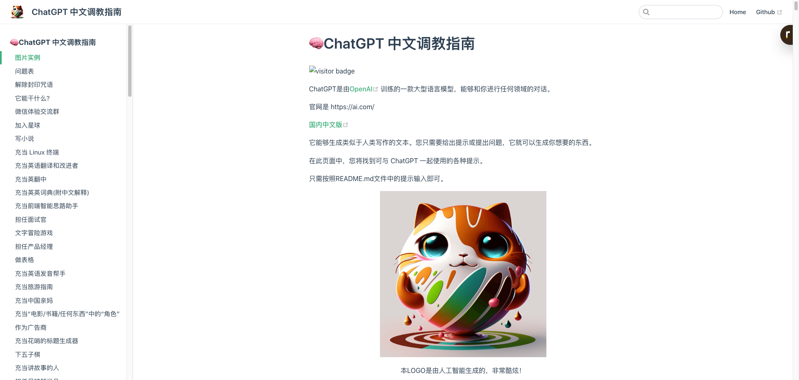

# chat-gpt-full-stack
chatgpt 全栈解决方案  快速接入openai 
产品方案  运营策略  技术方案+实现

chatgpt full stack solution  

中文 - [English](./README_en.md)

# 开始更新-聊天UI方案

# SPA 
## vue2

## vue3

## react
 
# SSR
## next
> Next.js是一个基于React框架的轻量级服务端渲染(SSR)框架，它提供了一些丰富的特性，如代码分割、静态文件导出、数据预取等等，使得开发React应用更加高效。
> Next.js还提供了极佳的开发体验，支持热重载(Hot-reload)和实时编译，可以让你在开发React应用时无需充斥大量的配置。
> 总的来说，Next.js 是用于简化 服务端渲染(SSR) 和 静态网站生成(SSG) 的 React 应用程序的开发和部署的工具。 它为开发人员提供了服务器渲染，静态导出等功能，从而实现更好的性能、SEO等。

### [ChatGPT Next Web](https://github.com/Yidadaa/ChatGPT-Next-Web)

  一键免费部署你的私人 ChatGPT 网页应用。

## astro方案
>Astro是一个全新的现代化的静态网站生成器，它采用了现代化的开发框架和技术，如React、Vue、Svelte等，并提供了一些预设的模板和组件，以简化开发过程。
>Astro采用完全静态的生成模式，可以在本地生成和预览站点，也可以在部署到任何支持静态站点托管的平台上。它提供了界面简洁、易于使用的开发体验，开发者可以使用它来构建各种类型的网站，包括静态网页、博客、电子商务网站等等。

### [chatgpt-demo](https://github.com/ddiu8081/chatgpt-demo)
一个基于 OpenAI GPT-3.5 Turbo API 的 demo。

https://github.com/ddiu8081/chatgpt-demo

### [QA power by gpt](https://github.com/gcloudlab/QA)
部署在Vercel的ChatGPT镜像站点（gpt-3.5-turbo）
支持随机生成预设场景（100+）
支持缓存会话

## php方案
### [chatpht power by php](https://user-images.githubusercontent.com/5563148/224522389-f60e3047-c0e6-49cd-bee7-80feaf2c86a4.png)

PHP版调用OpenAI的API接口进行问答的Demo，代码已更新为调用最新的gpt-3.5-turbo模型。 采用Stream流模式通信，一边生成一边输出，响应速度超过官网

# client 客户端

# weixin bot

## php方案
  [chatgpt-wechat-personal](https://github.com/dirk1983/chatgpt-wechat-personal)
  实现原理：
    腾讯服务器推送用户消息过来时，调用OpenAI的API接口，并将用户的问题和返回的结果存到日志文件中。
    在5秒内很可能收不到OpenAI返回的消息。没关系，直接让腾讯服务器发过来的请求响应超时。
    等腾讯第二次或第三次查询的时候，第一次请求调用OpenAI的结果也返回并写到文件中了，直接从文件中获取结果返回给用户。

  

# prompts 相关
## [Awesome ChatGPT Prompts](https://github.com/f/awesome-chatgpt-prompts)

- 官网 https://prompts.chat/
<video autoplay loop muted playsinline src="https://user-images.githubusercontent.com/196477/207992596-6846398c-9ee7-4d7b-8fbe-b7c9e6daad23.mov"></video>

## [ChatGPT 中文调教指南](https://github.com/PlexPt/awesome-chatgpt-prompts-zh)
- 官网 https://chatguide.plexpt.com/

